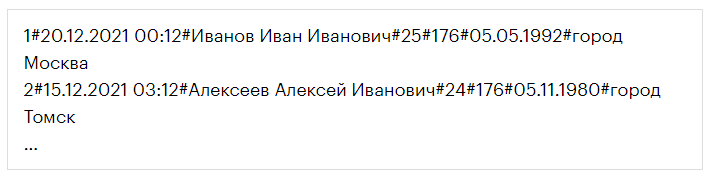

# Задание 1
**Цель задания:**  
-
Улучшите программу, которую разработали в модуле 6. Создайте структуру Worker со следующими свойствами:  
* ID
* Дата и время добавления записи
* Ф.И.О.
* Возраст
* Рост
* Дата рождения
* Место рождения

***
Создайте класс Repository, который будет отвечать за работу с экземплярами Worker.  
В репозитории должны быть реализованы следующие функции:

* Просмотр всех записей.
* Просмотр одной записи. Функция должна на вход принимать параметр ID записи, которую необходимо вывести на экран. 
* Создание записи.
* Удаление записи.
* Загрузка записей в выбранном диапазоне дат.

***

Имя файла должно храниться в приватном поле Repository. Файл, который использует репозиторий, должен выглядеть примерно так:  
  
Используя структуру Worker и класс Repository, в основном методе Main реализуйте программу для работы с записями.  
Также предоставьте пользователю возможность сортировать данные по разным полям.  
Можете добавить свои методы для дополнительного функционала.