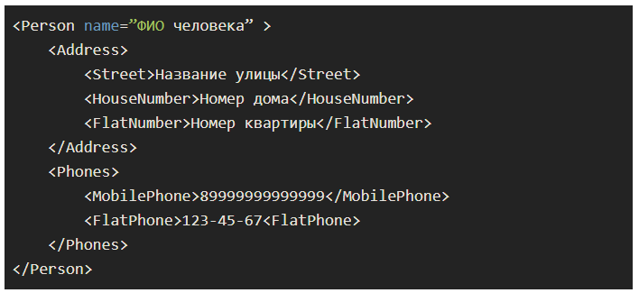

# Задание 4. Записная книжка
**Цель задания:**  
-
Программа спрашивает у пользователя данные о контакте:  
* ФИО
* Улица
* Номер дома
* Номер квартиры
* Мобильный телефон
* Домашний телефон

С помощью XElement создайте xml файл, в котором есть введенная информация. XML файл должен содержать следующую структуру:  
  
Также можно добавить сериализацию в формат json

